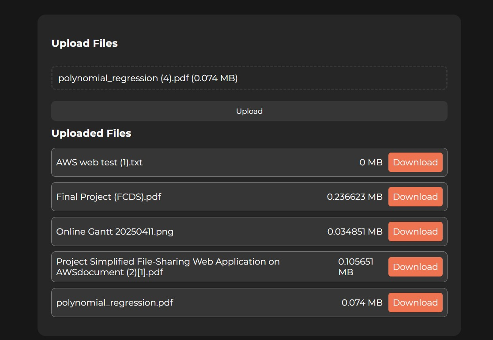
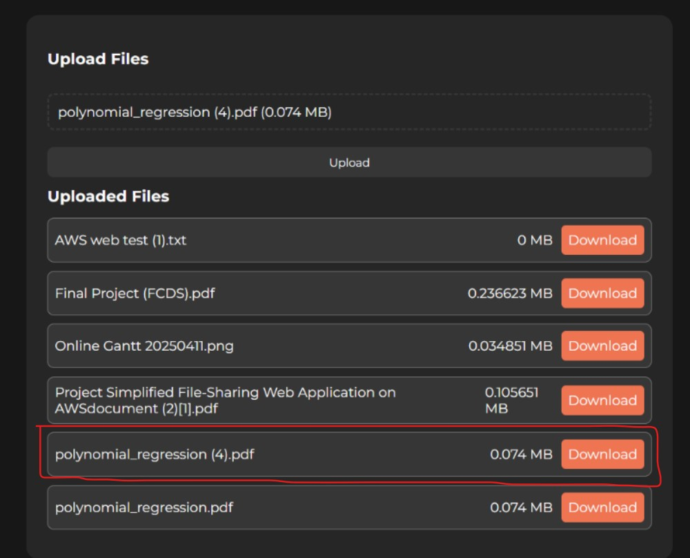

# Simplified File-Sharing Web Application on AWS

## Executive Summary

This project involved building a simplified file-sharing web application hosted on AWS, enabling users to upload and download files through a secure and scalable infrastructure. Our team utilized AWS services including EC2, S3, IAM, and VPC. The application features a React-based frontend and a Node.js backend. The system ensures secure file access and efficient storage using AWS best practices.

---

## Table of Contents

1. [Project Overview](#project-overview)  
2. [Team Members and Responsibilities](#team-members-and-responsibilities)  
3. [AWS Account Setup](#aws-account-setup)  
4. [VPC Configuration](#vpc-configuration)  
5. [IAM Role Setup](#iam-role-setup)  
6. [S3 Bucket Setup](#s3-bucket-setup)  
7. [EC2 Instance Configuration](#ec2-instance-configuration)  
8. [Web Application (Frontend & Backend)](#web-application-frontend--backend)  
9. [Testing and Validation](#testing-and-validation)  
10. [Bonus Features](#bonus-features)  
11. [Problems Faced and Solutions](#problems-faced-and-solutions)  
12. [Conclusion](#conclusion)

---

## Project Overview

A simplified web-based file-sharing tool allowing users to upload and download files securely. Hosted on AWS, it uses S3 for storage and EC2 for hosting. IAM controls access between services, and VPC ensures network isolation.

---

## Team Members and Responsibilities

- **Ahmed Amir** – AWS Account Setup & Documentation  
- **Ahmed Rashad** – S3 Setup and File Handling  
- **Youssef Sameh** – VPC Setup and Configuration  
- **Ahmed Elhadary** – EC2 Setup  
- **Yehia Zakaria** – Web App Development + Bonus Features  
- **Yehia Moustafa** – Bonus Tasks (details to be added)

---

## AWS Account Setup

- AWS Free Tier account created  
- Basic billing and support settings configured  
- IAM users and roles set with least-privilege policies

---

## VPC Configuration

- **VPC Name**: FileShare-VPC  
- **CIDR Block**: 10.0.0.0/16  
- **Subnet**: Public-Subnet-1  
- **Internet Gateway**: FileShare-IGW  
- **Route Table**: 0.0.0.0/0  
- **Security Group**: WebApp-SG  
- **Region**: us-east-1a  

---

## IAM Role Setup

- **Role Name**: EC2S3UploadRole  
- **Policy**: AmazonS3FullAccess  
- **Trusted entity**: EC2  

---

## S3 Bucket Setup

- **Bucket Name**: file-sharing-s3-project  
- **Versioning**: Disabled  
- **Public Access**: Blocked  
- **Policy**: EC2 Role only  
- **CORS**: Enabled  

---

## EC2 Instance Configuration

- **OS**: Ubuntu 24.x  
- **Type**: t2.micro  
- **Region**: us-east-1a  
- **Public IP**: 51.20.73.128  
- **Port**: 8000 opened  
- **User Data used**  

---

## Web Application (Frontend & Backend)

- **Frontend**: React  
- **Backend**: Node.js + Express  
- **Port**: 8000  
- **API Routes**:  
  - `/api/files`  
  - `/api/upload`  
  - `/api/download`  
- **.env** used securely  
- **Repo**: [GitHub Repository](https://github.com/yahia997/File-Uploader-with-AWS)

### CSS Styling

<details>
<summary>Click to view the CSS code</summary>

```css
* {
  margin: 0;
  padding: 0;
  box-sizing: border-box;
  font-family: "Montserrat", sans-serif;
  color: var(--white);
}

:root {
  --dark-1: #171717;
  --dark-2: #262626;
  --dark-3: #363636;
  --white: #fbfbfb;
  --orange: #ee7452;
}

body {
  display: flex;
  justify-content: center;
  align-items: center;
  background-color: var(--dark-1);
  height: 100vh;
}

main {
  width: 50vw;
  background-color: var(--dark-2);
  border-radius: 15px;
  padding: 30px 25px;
}

button[type='submit'] {
  border-radius: 8px;
  background-color: var(--dark-3);
  color: var(--white);
  padding: 10px 0;
  width: 100%;
  transition: all 0.4s ease;
}

button[type='submit']:hover {
  opacity: 0.8;
}

.file {
  background-color: var(--dark-3);
  border: 1px solid rgba(255, 255, 255, 0.345);
  width: 100%;
  margin: 5px 0;
  border-radius: 8px;
  display: flex;
  justify-content: space-between;
  padding: 8px;
}

.file a {
  background-color: var(--orange);
  border-radius: 5px;
  text-decoration: none;
  padding: 8px;
}
```

</details>

---

## Testing and Validation

- File uploaded and verified in S3  
- Download link tested  

**Before:**  


**After:**  


---

## Bonus Features

- Displayed file list in UI  
- Applied UI styling  

---

## Problems Faced and Solutions

- **CORS Issue**: Solved by CORS configuration  
- **IAM Denial**: Fixed role permissions  
- **Node Modules**: Installed via `npm`  
- **.env Exposure**: Prevented using `.gitignore`  

---

## Conclusion

This project provided hands-on experience with deploying a cloud-native file-sharing application. By integrating key AWS services with a full-stack web app, our team gained valuable DevOps, security, and infrastructure management skills.
